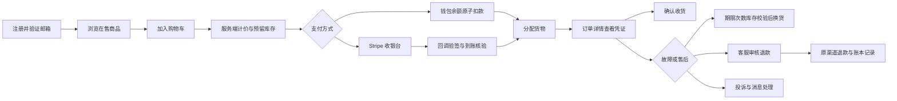

# GoAifast 电商业务审计与实现说明

审计基线：`d2410d1`。业务范围：USD 计价的数字商品（卡密、兑换码、账号交付），Stripe 一次性支付和钱包余额支付。

## 原项目的关键问题

| 模块 | 原状与影响 | 本次实现 |
| --- | --- | --- |
| 购物车 | 图标固定为 0，没有真实购物车 | 持久化 SKU ID / 数量，多商品结算，商品上下架及库存校验 |
| 结算 | 始终购买固定 Netflix 示例，金额和 paid 状态由浏览器写入 | 服务端重新读取在售 SKU、核对预览总价、生成订单和待支付记录 |
| 支付 | 卡、PayPal、USDT 仅为选项，没有真实收单 | Stripe Hosted Checkout、验签回调、金额/币种/凭据校验、重复请求幂等处理 |
| 钱包 | 页面显示固定金额，没有真实资金账本 | 充值、余额支付、逐笔流水、剩余余额部分原路退款、失败退款解冻 |
| 订单 | 买家可任意更新、删除订单，详情存在示例交付数据 | 移除直接写权限；待支付、处理中、交付、完成、取消及退款状态转换 |
| 库存 | 展示库存与账号池和交易订单分离 | 真实库存预留、去重导入、有效期校验、独占分配、停用、低库存提示 |
| 自动发货 | 无到账驱动的实际交付 | 支付确认后分配数字货物；人工模式由管理员确认；过期库存重配或待处理 |
| 售后 | 工单主要为后台演示数据 | 订单关联的退款、故障换货、咨询和投诉；顾客与客服消息往来 |
| 自动换货 | 没有规则引擎 | 购买时快照售后期限和次数；符合规则的顾客故障申请自动换货；缺货等转人工 |
| 账户 | 基础注册登录、昵称头像修改 | 验证邮件提示/重发，资料及电话、邮箱、密码修改，退出、密码复核删除账号 |
| 删除账户 | 没有交易结清检查 | 检查余额/订单/支付/退款/售后；关闭新交易并匿名化，再删除 Auth 身份，保留交易账本 |
| 管理权限 | `/admin` 无路由保护，多张运营表所有登录用户可读写 | 所有后台入口使用管理员权限；历史宽松策略收紧；新交易表不允许客户端直写 |
| 运营恢复 | 无支付回调遗漏/中断恢复 | 管理员核对 Stripe 支付与退款，释放确认未付款的过期预留，未能证明的记录保留人工复核 |

## 实现后的主流程

库存、金额和状态都以数据库事务为准。浏览器回跳仅用于展示和查询，不能证明到账。订单不会因“删除记录”而丢失追账依据。订单的价格、名称和售后规则保存快照，之后修改商品不会改变已购权益。

自动换货由顾客报告商品故障触发。系统会标记旧凭证不可再次出售，并交付新库存；没有供应商 API 时，无法自动检测第三方账号失效，也无法真正撤销已交付的外部账号或兑换码。多份同 SKU 商品的换货以该订单项整组为单位。

## 页面入口

| 路径 | 作用 |
| --- | --- |
| `/cart`、`/checkout` | 购物车、价格核对、选择 Stripe 或余额 |
| `/orders`、`/order/:id` | 订单、继续付款、取消、交付凭证、收货和订单售后 |
| `/profile` | 资料、邮箱、密码、退出、账号删除 |
| `/wallet` | 余额、充值、流水和充值部分退款 |
| `/support` | 一般咨询、投诉、客服回复 |
| `/admin` | 新商家中心：商品、库存、订单、工单、支付退款和核对 |
| `/admin/products` | 原有商品详情编辑 |
| `/admin/content` | 站点内容配置；保存不会覆盖新商品、库存或交易账本 |

## 上线前仍需配置或补充

1. **部署与实测**：本次不会自动改写云端数据库。需核对目标 Supabase、应用迁移、部署 Edge Functions、配置 Stripe 测试密钥并完成真实测试模式联调，再配置正式密钥。详见 `commerce-setup.md`。
2. **账户安全配置**：Supabase 邮箱验证、SMTP、正确的跳转白名单、安全邮箱/密码修改及注册限流需要在服务控制台启用。OAuth 依赖对应供应商配置。
3. **支付渠道范围**：当前 Checkout 明确使用银行卡，支持 Stripe 在该卡支付流程内提供的钱包能力。支付宝、微信、银行转账等渠道及其异步到账规则没有默认启用。没有自动续费；不同周期应配置为独立 SKU。
4. **退款范围**：商品订单支持全额退款；钱包充值支持部分原路退款。未实现按订单内某一项/某一份商品退款。应从本站审批退款，Stripe 控制台手动退款、拒付、争议和扣款撤销需要额外对账处理。
5. **通知与证据**：交付和售后消息在站内查看；除 Supabase Auth 邮件外，未配置交易邮件、短信、附件证据上传、客服 SLA 提醒和供应商故障检测。
6. **商品运营**：没有统一的税费/发票、优惠券、佣金结算、积分、评价审核、多币种独立定价或实体物流。原有装饰性折扣与内容模块不能替代这些账务功能。
7. **现有政策核对**：旧退款政策包含按剩余订阅天数退款、隐私政策包含固定留存期限，目前未实现按天计算退款或自动到期清理。正式开店前须按实际经营政策补齐实现并核对公开条款。
8. **容量与运维**：当前管理快照适合初期业务；大量订单需要分页、查询索引评估、日志告警、定时支付核对、备份恢复演练、PostgreSQL 多连接并发测试、密钥轮换与供应商凭证加密方案。

此版本提供可部署、可测试的核心交易流程；尚未在你的真实 Stripe 商户及云端数据库完成联调，不能等同于已经可以正式收款的线上商城。

## 设计依据

- Stripe 要求通过服务端支付完成通知落实交付，见 [Checkout fulfillment](https://docs.stripe.com/checkout/fulfillment)。
- 回调使用原始请求体校验签名，见 [Webhook signature verification](https://docs.stripe.com/webhooks/signature)。
- 原支付渠道退款参见 [Stripe Refund API](https://docs.stripe.com/api/refunds/create)。
- 删除 Auth 用户不会立刻让所有已签发 JWT 失效，因此数据库额外保存账户关闭标志并拒绝新交易，见 [Supabase user management](https://supabase.com/docs/guides/auth/managing-user-data)。
